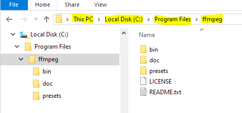
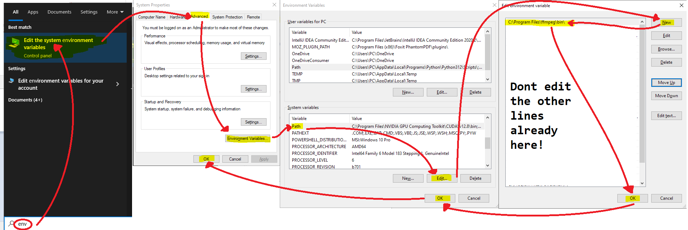
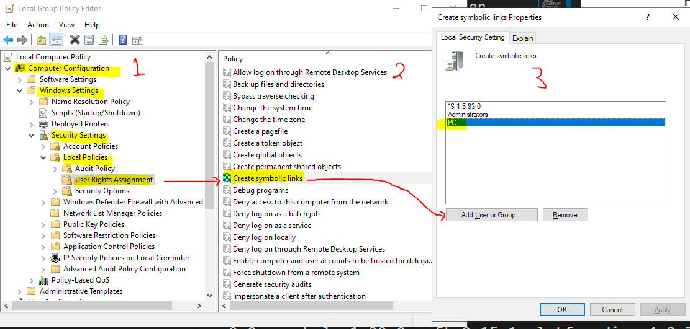
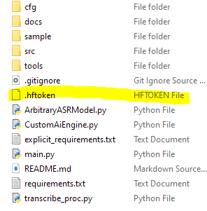

# Transcriber
- Uses various [`openai-whisper`](https://github.com/openai/whisper) based models to transcribe audio or video files.
- Runs locally.
- Outputs into a clean .cha file by utterance.
- As always, TRUST NOTHING GENERATED BY AI, and always verify

## Installation:
1. **Internet** 
    - For installation of the transcriber
    - For the AI model download - on the first time you use a model

1. **Python 3.11+**:
    - Download and install python here: [https://www.python.org/downloads/](https://www.python.org/downloads/)
    - _Tested on 3.11, 3.12, and 3.13_
    - If using the installer, use the following configuration options:
        - Click on `Modify` or `Customize installation` _(whichever one you see)_
        - Select `Add python.exe to PATH` _(for ease of use)_
        - Select `pip` _(to install pip)_
        - Select `tcl/tk and IDLE` _(to install tkinter)_
        - Select `Add python to environment variables` _(might be on the second page)_
        - Select `Download debugging symbols` _(might be on the second page)_
        - Reccomended to select `Install Python for all users` _(might be on the second page)_
    - You might need to restart your computer here if it prompts you for it
    - _NOTE: If you already have python installed, make sure you have tkinter tcl/tk installed!_
        - Check by running the command:
            `python -m tkinter`
            If a window pops up, you have it installed and can continue to the next requirement step!
        - To install:
            - MacOS:
                - Run the command: `brew install python-tk`
            - Windows:
                - Download the installer for the version of python you currently have and follow the installation configuration.
            `python --version`

1. **GIT**:
    - Check to see if you have git installed by running the command:
        `git --version`
        or 
        `python -c 'command="git"; import shutil; path = shutil.which(command); print(f"{command} installed @ {path}" if path else f"{command} is not installed or cannot be found!")'`
        
        If you do have git, you can skip to the next requirement.
    - See here for detailed guide on installing git or skip to the section for your OS: [https://git-scm.com/book/en/v2/Getting-Started-Installing-Git#main](https://git-scm.com/book/en/v2/Getting-Started-Installing-Git#main)
    - MacOS:
        - Install the Xcode Command Line Tools. On Mavericks (10.9) or above, start by checking to see if you have it installed already by running the following command:
        `git --version`
        If you don’t have it installed already, it should prompt you to install it. If it does not, see the detailed guide on installing git above.
    - Windows:
        - Install git for windows from the offical git website: [https://git-scm.com/downloads/win](https://git-scm.com/downloads/win)
            - Click on the first install link. It should look like the following
                > Click here to download the latest (##.##.##) x64 version of Git for Windows.
            - When installing, use the default configuration for all steps except:
                - **Choosing the default editor used by Git**: 
                    Select an application that you already have for ease of use, recomended to select "Use Notepad as Git's default editor".
                - **Configure line ending conversions**: 
                    Choose "checkout as-is, commit Unix Style line endings".
                - **Configure extra options**: 
                    Select "Enable symbolic links" - checking this here might allow you to skip one of the install steps later on.
    - Linux:
        - `sudo apt install git-all`

1. **FFMPEG**:
    - Check to see if you have FFMPEG installed by running the command:
        `ffmpeg -version`
        or
        `python -c 'command="ffmpeg"; import shutil; path = shutil.which(command); print(f"{command} installed @ {path}" if path else f"{command} is not installed or cannot be found!")'`
    - MacOS: install ffmpeg to be made available by the command line
        - `brew install ffmpeg`
    - Windows:
        - Install here [instant download link to zip file](https://github.com/BtbN/FFmpeg-Builds/releases/download/latest/ffmpeg-master-latest-win64-gpl-shared.zip) or follow the instructions on the offical ffmpeg webiste here [https://ffmpeg.org/download.html](https://ffmpeg.org/download.html).
        - If you downloaded a zip file follow these steps:
            - Unzip (or move the unzipped files) to `C:/Program Files/ffmpeg`
                The results should look like the following:
                
            - Add the `C:/Program Files/ffmpeg/bin` (or wherever you downloaded it to + `/bin`) to your system environment PATH variable
                - in windows bar search, type "`env`" and follow the arrows in the image below
                - when you click "new" enter `C:\Program Files\ffmpeg\bin`. DO NOT EDIT ANY OTHER LINE THAT IS ALREADY THERE!
                

1. **CUDA**
    - If you can, use CUDA to increase performance when running the AI.
    - __NOTE: You will probably need a NVIDIA GPU for this.__
    - See here to install: [https://pytorch.org/get-started/locally/](https://pytorch.org/get-started/locally/)

1. **Python's tkinter** needs to be installed
    - If you installed python with the installer and selected the tk/tcl and IDLE options, you should have this step completed already.
    - MacOS:
        - Run the command: `brew install python-tk`
    - Windows:
        - See the install **Python 3.11+** step and download the installer for the version of python you currently have.
        `python --version`


1. If on windows and did not select the `"enable symbolic links"` option when installing **GIT**, do the following: 
    - Enable symbolic links on your machine.
    - Open the Local group policy editor and add your account user to the following:
    

1. **The Transcriber**:
    - Now that you have all of the requirements installed we will install the Transcriber from git
        1. Open your choice terminal window
            - Reccomended to use `Powershell` or `git bash` on windows, use default terminal on Mac/linux
        1. use "cd" to change directory to where you want to install the transcriber
            example: to your Documents folder:
            `cd ~/Documents`
        1. Clone the Transcriber repo:
            `git clone https://github.com/Noah-Jaffe/Transcriber.git`
            _NOTE: If you get the error: `fatal: destination path 'Transcriber' already exists and is not an empty directory.`, you will need to either delete the existing Transcriber folder, or rename the existing one. Or install to a custom directory by replacing NEW_FOLDER_NAME in the following command: `git clone https://github.com/Noah-Jaffe/Transcriber.git NEW_FOLDER_NAME`._
        1. Enter the Transcriber directory in the terminal
            `cd Transcriber` or `cd ~/Documents/Transcriber`
        1. Setup a python virtual environment if you want, skip this step if you are unfamiliar.
            `python -m venv .venv`
            - <a id="start-activate-venv"></a>Start/Activate your virtual python environment with
                - Windows 
                    - Powershell `./.venv/Scripts/activate`
                    - git bash `source ./.venv/Scripts/activate`
                - MacOS/Linux
                    - `source ./.venv/bin/activate`

        1. <a id="pip install"></a>`pip install -r requirements.txt`
            - if the pip install fails try `pip install -r explicit_requirements.txt --no-cache`
            - if that fails, [report the issue to the maintainer or your point of contact](https://github.com/Noah-Jaffe/Transcriber/issues)
            - The only requirements not in the txt files are `torch` `torchaudio` and `torchvision`
        1. Install requirements not in requirements.txt

            - If you have a CUDA compatible GPU:
                - [Install CUDA](https://docs.nvidia.com/cuda/cuda-quick-start-guide/) if you have not done so already.
                - You may need to `pip uninstall torch torchaudio torchvision` before doing this next step.
                - [Reinstall `torch` `torchaudio` and `torchvision` with your appropriate build](https://pytorch.org/get-started/locally/)
                    - Example for if you have a CUDA compatible device for 12.6 you would run: `pip install torch torchvision torchaudio --no-cache -U --index-url https://download.pytorch.org/whl/cu126`
            - Otherwise if you dont have a CUDA compatible GPU or dont know what that means then run the next line:
                - `pip install torch torchaudio torchvision`
        1. Put your [Huggingface token](https://huggingface.co/docs/hub/en/security-tokens) in a file named `.hftoken`.
            - `.hftoken` only, `.hftoken.txt` will not work
                
            - Generating the token:
                - You may need to create an account, you can skip all the optional steps except for verifying your email.
                - You can name the token anything, just save the token to a file called `.hftoken` to your machine.
                - The token does not need any special permissions, you can deselect all of the options.

        1. If you want to make a one click startup script, you could do so now.
            - Example for windows:
                Save anywhere as "`Transcribe.ps1`"
                ```sh
                cd ~/Documents/Transcriber
                # if you used a virtual environment uncomment the next line (remove the #)
                #./venv/Scripts/activate
                python main.py
                ```
            - Example for Mac/Linux
                Save anywhere as "`Transcribe.sh`"
                ```
                #!/bin/bash
                cd ~/Documents/Transcriber
                # if you used a virtual environment uncomment the next line (remove the #)
                # source .venv/bin/activate
                python main.py
                ```
                _You may need to run `chmod +x Transcriber.sh` on the new .sh file to give it permissions to execute_
            - _NOTE: You might need to do some additional research for how to do this properly for your machine._
1. Continue to the [using the transcriber](#using-the-transcriber) step.
        
---

## Using the transcriber
1. Start the application
    - If using a virtual environment start/activate that now. [See here](#start-activate-venv)
    - Run the program with
        `python ./main.py`
    - Or use your one click script file.
1. Select files (button) to be transcribed.
    - Set the number of speakers in the number box.
    - [Optional] Set the language (if not english).
1. Select AI model to use from the drop down.
    - Hover over the drop down to see some selection guidance. Choose one that your device can handle.
    - [Read more about the models here.](https://github.com/openai/whisper?tab=readme-ov-file#available-models-and-languages)
4. Start transcript (button).
5. Wait for final results popup to appear. _Your transcribed files should automatically open as they are completed._
6. Review resulting transcripts.


# Frequently asked questions:

### Help, I got a `TypeError: ... not supported between instances of 'NoneType' and 'float'`!

If you run into the following errors specifically in the Whisper (Step 1), know that this is an error of the AI and not entirely in our control. 
> `TypeError: '<=' not supported between instances of 'NoneType' and 'float'`

> `TypeError: '>' not supported between instances of 'NoneType' and 'float'`

The only known current workaround is to split up the original file into smaller segments and run the smaller segments through the transcriber again. eventually you may hit a small section of the original audio file that crashes constantly, for that you will have to transcribe by hand.

_v1.1.0_ is in the works with an automated fix for this

### How to update my Transcriber app?

If you followed the instructions on this readme file, or installed this repo with git:
1. Enter the Transcriber directory in the terminal
`cd Transcriber` or `cd ~/Documents/Transcriber`
1. Update to the latest version with the following commands:
`git pull`
1. Re-install the latest requirements
    - If using a virtual environment start/activate that now if it is not already activated. [See here](#start-activate-venv)
    - [reinstall pip requirements](#pip-install)
- [Optional] Check the readme, changelog, or release notes to see if there is anything else you need to change.

### Help, some error occured that is not covered elsewhere!

- Send as much relevant info to the maintainer such as:
    - [ ] the terminal logs
    - [ ] screenshots of what is wrong
    - [ ] explinations for what was expected to happen
    - [ ] .cha file (you can remove sensitive information from the transcripts, but leave the @debug lines)

### How do I get rid of these ugly @debug lines in my .cha file?

Edit your [transcribe_proc.py](transcribe_proc.py) file to update that the line that is
`DEBUG_MODE = True`
to
`DEBUG_MODE = False`

### Where is the core logic for the AI?

See function `transcribe_file` in [transcribe_proc.py](transcribe_proc.py). Note that you can ignore the chunks that reference or are dependant on DEBUG.

### Yall got some Morphosyntax?
In function `transcribe_file` in [transcribe_proc.py](transcribe_proc.py): 
Uncomment the line inside the `pipeline_activity` variable array:
```
        # morphosyntax,
```
so that it looks like
```
        morphosyntax,
```

---

### Backlog ideas:
- [ ] Advanced/Runtime configuration of AI parameters?
    - [ ] multiple times or using different models?
    - _note that you can do this by scripting something to use the transcribe_proc.py. See the file for how to pass values._
- [ ] Bundle into single executable to be more user friendly?
- [ ] Select subframe of time to transcribe from?
- [ ] Better error handling


